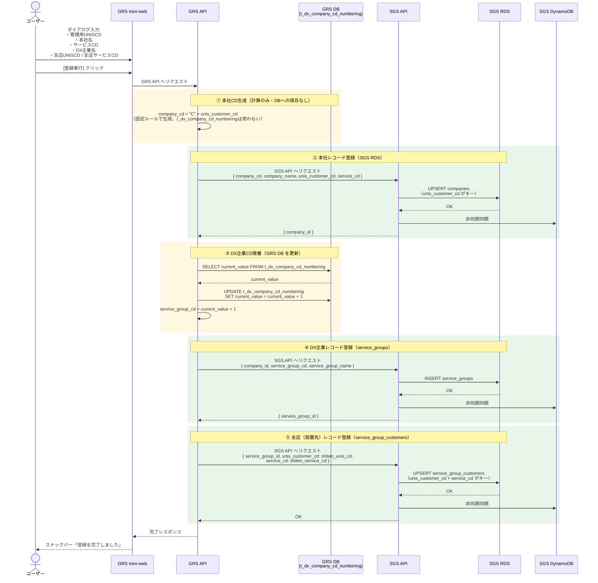
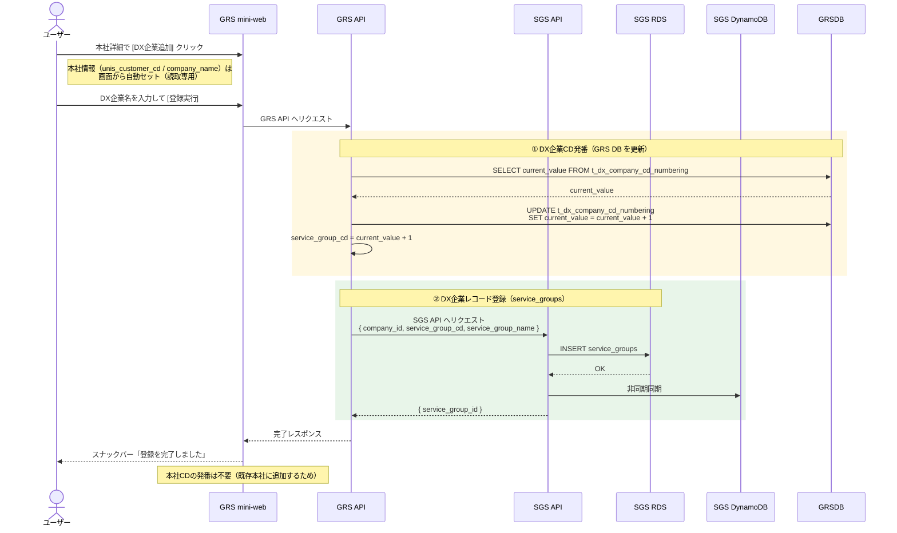
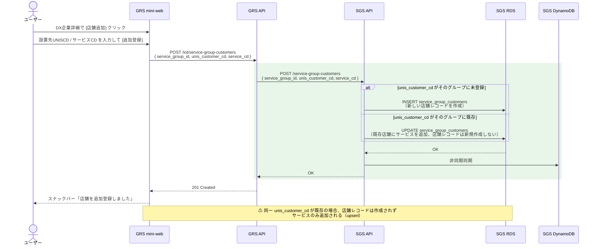
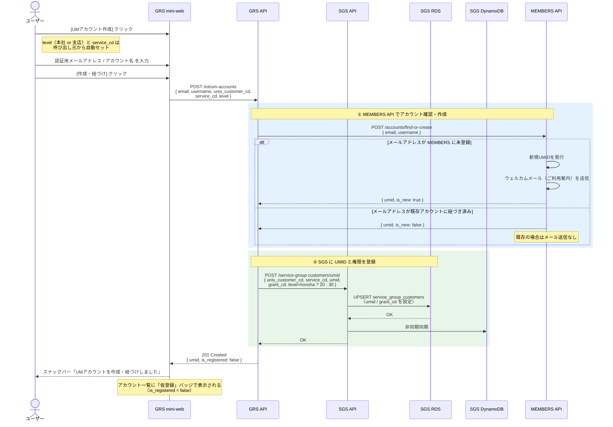
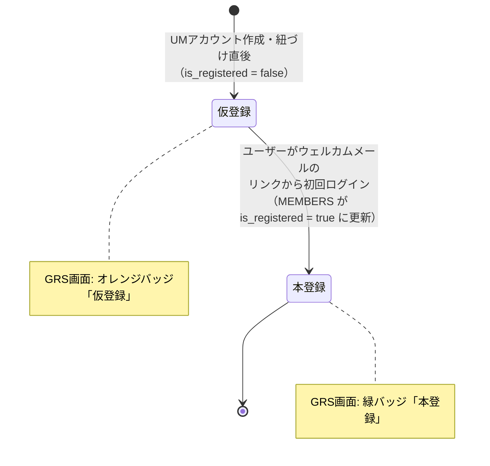
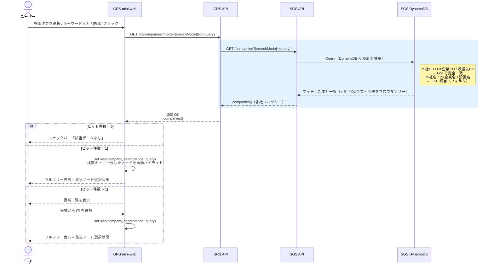
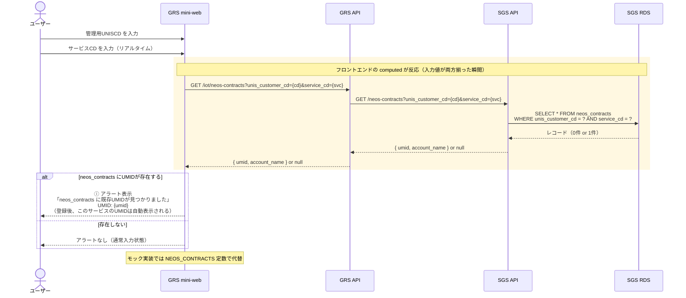
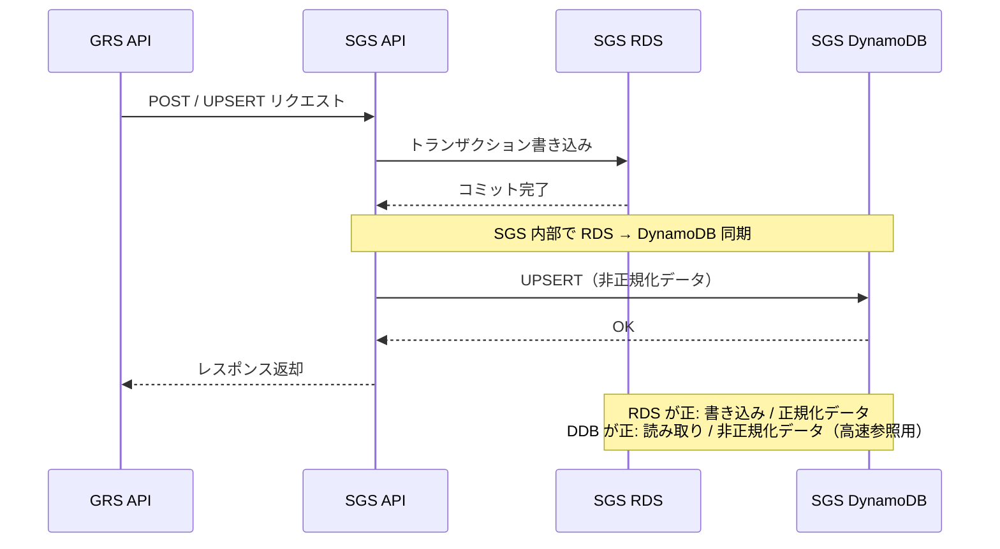

# IoT 階層管理機能 システムフロー

作成日: 2026-04-07
対象システム: GRS（usen-grs-mini-web）/ SGS / MEMBERS

---

## 登場するコンポーネント

| 略称 | 正式名 | 役割 |
|------|--------|------|
| **Web** | GRS mini-web (Vue) | フロントエンド画面 |
| **GRS** | GRS API (AWS SAM / Lambda) | バックエンドAPI。SGS・MEMBERSへのブリッジ |
| **GRSDB** | GRS DB (MySQL) | GRS固有テーブル。`t_dx_company_cd_numbering` のみ本機能で更新 |
| **SGS** | SGS API (Hono / Prisma) | データ保存先。RDS + DynamoDB の二重管理 |
| **RDS** | SGS RDS (MySQL) | 正規化マスタデータ（companies / service_groups / service_group_customers 等） |
| **DDB** | SGS DynamoDB | 参照用の非正規化データ。RDS書き込み後に SGS 内部で同期 |
| **MEM** | MEMBERS API | UMIDアカウント管理・ウェルカムメール送信 |

> **書き込みの原則:** GRS は SGS RDB へ直接 POST する（GRS DB には保存しない）。DynamoDB の同期は SGS 内部処理が担う。

---

## SF-1: 本社 / DX企業登録（新規モード）

---

## SF-2: DX企業追加（addGroup モード）

---

## SF-3: 店舗追加（upsert）

---

## SF-4: UMアカウント作成・紐づけ（共通フロー）

新規作成と既存紐づけを統合した単一フロー。メールアドレスの存在有無によって MEMBERSが自動で処理を分岐する。

**権限CDの自動設定:**

| level | 権限CD | 権限名 |
|-------|--------|--------|
| honsha（本社） | 20 | 本社管理 |
| store（支店） | 30 | 支店管理 |

> シェア権限（21: 本社シェア / 31: 支店シェア）は廃止のため選択肢なし。

---

## SF-5: 仮登録 → 本登録の状態遷移

UMアカウント作成直後は `is_registered = false`（仮登録）。ユーザーがウェルカムメールのリンクから初回ログインすると、MEMBERS 側が `is_registered = true` に更新する。

---

## SF-6: 検索フロー

**ハイライト対象ノードの決定ロジック:**

| 検索タブ | ハイライト対象 | 展開動作 |
|---------|--------------|---------|
| 本社CD / 本社名 | 本社ノード | そのまま表示 |
| DX企業CD / DX企業名 | 一致した DX企業ノード | 親本社を自動展開 |
| 設置先CD / 設置名 | 一致した 店舗×サービス行 | 親本社・DX企業を自動展開 |

---

## SF-7: 本社登録時の neos_contracts 確認（フロントエンド）

本社情報のサービスCD入力に反応して、リアルタイムで既存UMIDを確認する。

---

## SF-8: データ整合性の保証（SGS DynamoDB 同期）

---

## まとめ: 各フローが更新するテーブル

| 操作 | GRS DB | SGS RDS | SGS DynamoDB | MEMBERS |
|------|--------|---------|--------------|---------|
| 本社/DX企業登録（新規） | `t_dx_company_cd_numbering`（DX企業CD発番） | `companies` `service_groups` `service_group_customers` | ◎（SGS内部で同期） | - |
| DX企業追加 | `t_dx_company_cd_numbering`（DX企業CD発番） | `service_groups` | ◎ | - |
| 店舗追加 | - | `service_group_customers` | ◎ | - |
| UMアカウント作成（新規） | - | `service_group_customers`（umid/grant_cd） | ◎ | アカウント作成・メール送信 |
| UMアカウント紐づけ（既存） | - | `service_group_customers`（umid/grant_cd） | ◎ | - |
| 仮→本登録遷移 | - | `service_group_customers`（is_registered） | ◎ | is_registered 更新 |
| 検索 | - | - | 参照のみ | - |
