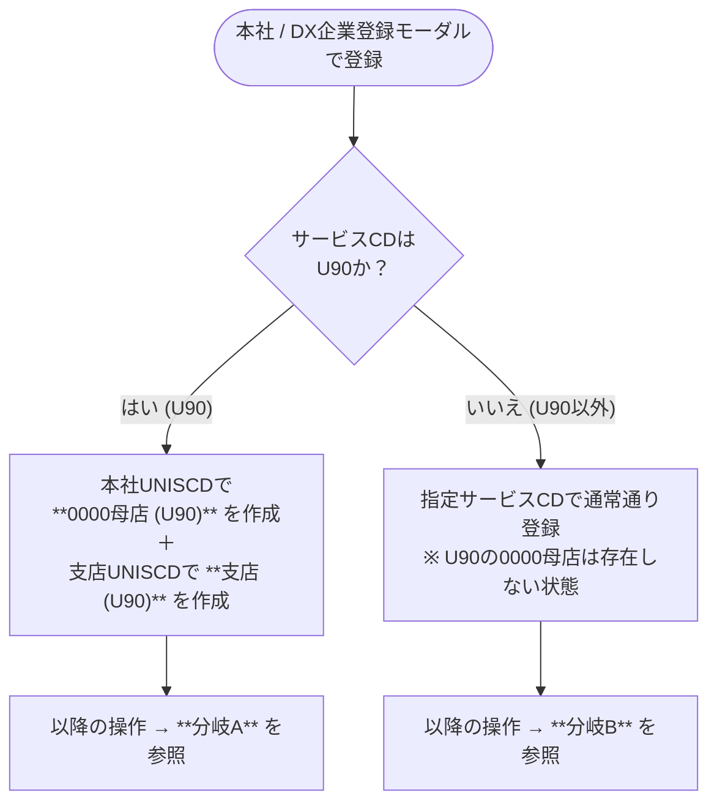
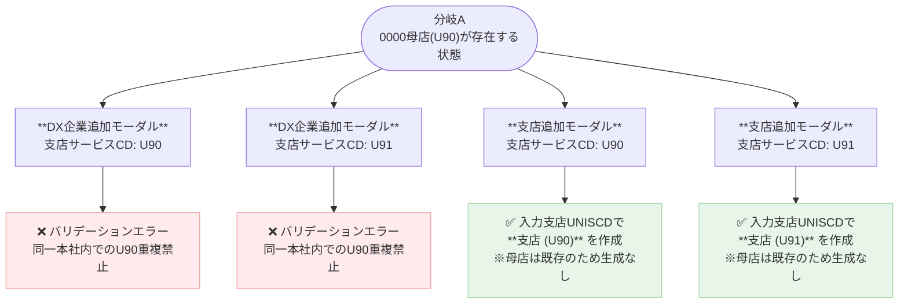
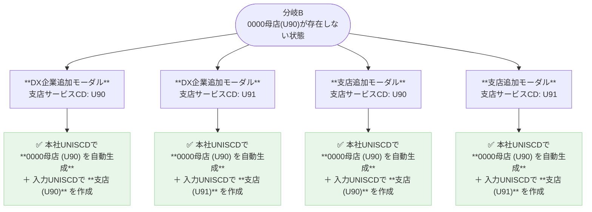

# サイネージ（U90/U91）登録ルール

作成日: 2026-04-07

---

## 前提知識

| 用語 | 意味 |
|------|------|
| **0000母店** | 本社UNISCDに紐づく特殊な店舗（store_cd='0000'）。U90系サービスの親拠点 |
| **U90** | サイネージ。本社内に0000母店が1つだけ存在できる |
| **U91** | Wifi。U90母店の存在を前提とする |
| **同一本社内U90重複禁止** | 本社に0000母店(U90)がすでに存在する場合、DX企業追加でU90/U91を指定するとエラーになる |

---

## 判定の起点：本社作成時のサービスCD

---

## 分岐A：本社に「U90の0000母店」がすでに存在する場合

---

## 分岐B：本社に「U90の0000母店」が存在しない場合

---

## まとめ表

| 操作 | 指定CD | 0000母店(U90)あり | 0000母店(U90)なし |
|------|--------|:----------------:|:----------------:|
| **DX企業追加** | U90 | ❌ エラー | ✅ 0000母店自動生成 + U90支店作成 |
| **DX企業追加** | U91 | ❌ エラー | ✅ 0000母店自動生成 + U91支店作成 |
| **支店追加** | U90 | ✅ U90支店のみ作成 | ✅ 0000母店自動生成 + U90支店作成 |
| **支店追加** | U91 | ✅ U91支店のみ作成 | ✅ 0000母店自動生成 + U91支店作成 |

---

## ポイントまとめ

- **0000母店 (U90) は本社に1つだけ存在できる**
- U90・U91 いずれの支店も、登録時に本社の **0000母店(U90)が存在しなければ自動生成される**
- 0000母店が既にある状態で **DX企業追加** に U90/U91 を指定するとエラー（重複禁止）
- 0000母店が既にある状態で **支店追加** に U90/U91 を指定するのは問題なし（支店のみ作成）
- DX企業追加とのエラー差分は「新しい DX企業ごと母店の重複を生もうとするから」
