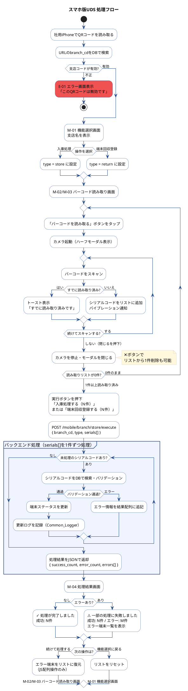

# UX設計：スマホ版UDS — 入庫処理・回収済み処理

**作成日:** 2026-06-01  
**前提:**
- デバイス：社用iPhone（iOS Safari）
- アクセス：VPN（AnyConnect）経由、QRコード読み取りでURLへアクセス
- バーコード読み取り：カメラAPIを使用
- 一括処理：複数読み取り後、ボタン押下で一括実行
- エラー時：エラー端末のみ報告し、成功分は処理を確定する

---

## 1. 画面一覧

| 画面ID | 画面名 | URL |
|--------|--------|-----|
| M-01 | 機能選択画面 | `/mobile/branch/store?branch_cd={branch_cd}` |
| M-02 | バーコード読み取り画面（入庫処理） | `/mobile/branch/store/scan?branch_cd={branch_cd}&type=store` |
| M-03 | バーコード読み取り画面（端末回収登録） | `/mobile/branch/store/scan?branch_cd={branch_cd}&type=return` |
| M-04 | 処理結果画面 | POST後レスポンスで表示（同URL） |
| E-01 | エラー画面（支店コード不正） | 自動遷移 |

---

## 2. 画面遷移図

```
QRコード読み取り
      │
      ▼
  [M-01] 機能選択画面
  ○○支店であることを確認
      │
      ├─── 「入庫処理」押下 ────────► [M-02] バーコード読み取り（入庫処理）
      │                                          │
      └─── 「端末回収登録」押下 ───────► [M-03] バーコード読み取り（回収済み）
                                                 │
                                    （共通）      │ 「実行」ボタン押下
                                                 ▼
                                          [M-04] 処理結果画面
                                                 │
                                    ┌────────────┴───────────┐
                                    │                         │
                              「続けて処理する」         「機能選択に戻る」
                                    │                         │
                              [M-02/03] に戻る          [M-01] に戻る
                              （エラー端末をリストに復元）
```

---

## 2-1. 処理フロー図（PlantUML）



---

## 3. 各画面のワイヤーフレーム

---

### M-01 機能選択画面

```
┌─────────────────────────────────┐
│                                  │
│         ┌──────────┐            │
│         │  UDS ロゴ │            │
│         └──────────┘            │
│                                  │
│  ┌──────────────────────────┐   │
│  │        ○○支店            │   │  ← branch_cdからDB取得した支店名
│  └──────────────────────────┘   │
│                                  │
│  ┌──────────────────────────┐   │
│  │                           │   │
│  │       入庫処理        │   │  ← c-btn is-ok （緑）
│  │                           │   │
│  └──────────────────────────┘   │
│                                  │
│  ┌──────────────────────────┐   │
│  │                           │   │
│  │      端末回収登録       │   │  ← c-btn is-blue （青）
│  │                           │   │
│  └──────────────────────────┘   │
│                                  │
└─────────────────────────────────┘
```

**仕様:**
- `branch_cd` が存在しない・無効な場合はエラー画面（E-01）へ遷移
- 支店名は画面上部に常に表示し、誤操作を防ぐ
- ボタンは大きく（タップしやすい高さ 56px 以上）

---

### M-02/M-03 バーコード読み取り画面

```
┌─────────────────────────────────┐
│ ← 戻る                           │
│ ○○支店 ／ 入庫処理           │  ← 支店名 + 機能名をヘッダーに表示
├─────────────────────────────────┤
│                                  │
│  ┌──────────────────────────┐   │
│  │                           │   │
│  │    📷 バーコードを        │   │  ← c-btn is-yes（大ボタン）
│  │       読み取る            │   │     タップでカメラ起動
│  │                           │   │
│  └──────────────────────────┘   │
│                                  │
│  読み取り済み（2件）              │  ← 読み取り件数をリアルタイム表示
│  ────────────────────────────   │
│                                  │
│  ┌──────────────────────────┐   │
│  │  ABC123456789    ╳       │   │  ← 読み取ったシリアルコード ＋ 削除ボタン
│  └──────────────────────────┘   │
│  ┌──────────────────────────┐   │
│  │  DEF987654321    ╳       │   │
│  └──────────────────────────┘   │
│                                  │
│                                  │
│  ┌──────────────────────────┐   │
│  │                           │   │
│  │  入庫処理する（2件）  │   │  ← c-btn is-ok （件数が0のときdisable）
│  │                           │   │
│  └──────────────────────────┘   │
│                                  │
└─────────────────────────────────┘
```

**仕様:**

| 項目 | 内容 |
|------|------|
| カメラ起動 | タップするとカメラ起動（ハーフモーダルでカメラプレビューを表示） |
| 読み取り成功時 | ビープ音 + バイブレーション → リストに追加 → カメラ継続起動 |
| 重複読み取り | 同一シリアルコードを再読み取りした場合はトースト表示「すでに読み取り済みです」でスキップ |
| 削除ボタン（╳） | リストから1件削除 |
| 実行ボタン | 読み取り件数が0件のときは `is-disable` |
| 実行ボタンラベル | 機能に応じて「入庫処理する（N件）」「回収済みにする（N件）」 |
| 実行前確認 | 確認ダイアログは出さない（タップ操作の流れを止めない）※ 処理結果で確認できるため |

---

#### カメラ起動時のハーフモーダル

```
┌─────────────────────────────────┐
│                                  │
│  （背景：読み取り画面）           │
│                                  │
│  ┌──────────────────────────┐   │
│  │  バーコードを読み取って   │   │  ← モーダルタイトル
│  │       ください            │   │
│  │                           │   │
│  │  ┌────────────────────┐  │   │
│  │  │                    │  │   │
│  │  │   [カメラ映像]     │  │   │  ← videoタグでリアルタイムプレビュー
│  │  │   - - - - - - -    │  │   │     中央に読み取り枠（赤線）
│  │  │   |         |    |  │   │
│  │  │   - - - - - - -    │  │   │
│  │  │                    │  │   │
│  │  └────────────────────┘  │   │
│  │                           │   │
│  │  ┌────────────────────┐  │   │
│  │  │     閉じる         │  │   │  ← c-btn is-cancel
│  │  └────────────────────┘  │   │
│  └──────────────────────────┘   │
└─────────────────────────────────┘
```

---

### M-04 処理結果画面

**パターンA：全件成功**

```
┌─────────────────────────────────┐
│ ○○支店 ／ 入庫処理           │
├─────────────────────────────────┤
│                                  │
│       ✓  処理が完了しました       │  ← 緑アイコン
│                                  │
│  ┌──────────────────────────┐   │
│  │  成功   3件               │   │
│  └──────────────────────────┘   │
│                                  │
│  ┌──────────────────────────┐   │
│  │  続けて処理する           │   │  ← c-btn is-ok
│  └──────────────────────────┘   │
│  ┌──────────────────────────┐   │
│  │  機能選択に戻る           │   │  ← c-btn is-cancel
│  └──────────────────────────┘   │
│                                  │
└─────────────────────────────────┘
```

**パターンB：一部エラーあり**

```
┌─────────────────────────────────┐
│ ○○支店 ／ 入庫処理           │
├─────────────────────────────────┤
│                                  │
│    ⚠  一部の処理に失敗しました   │  ← 黄アイコン
│                                  │
│  ┌──────────────────────────┐   │
│  │  成功   2件               │   │
│  │  エラー 1件               │   │  ← エラー件数は赤文字
│  └──────────────────────────┘   │
│                                  │
│  エラーの端末                     │
│  ────────────────────────────   │
│  ┌──────────────────────────┐   │
│  │  XYZ112233445            │   │  ← シリアルコード
│  │  該当のシリアルコードが   │   │  ← エラー理由（既存バリデーション
│  │  見つかりません           │   │     のメッセージをそのまま表示）
│  └──────────────────────────┘   │
│                                  │
│  ┌──────────────────────────┐   │
│  │  続けて処理する           │   │  ← c-btn is-ok
│  └──────────────────────────┘   │
│  ┌──────────────────────────┐   │
│  │  機能選択に戻る           │   │  ← c-btn is-cancel
│  └──────────────────────────┘   │
│                                  │
└─────────────────────────────────┘
```

---

### E-01 エラー画面（支店コード不正）

```
┌─────────────────────────────────┐
│                                  │
│         ┌──────────┐            │
│         │  UDS ロゴ │            │
│         └──────────┘            │
│                                  │
│    ✕  アクセスできません         │  ← 赤アイコン
│                                  │
│  このQRコードは無効です。         │
│  正しいQRコードから               │
│  アクセスしてください。           │
│                                  │
└─────────────────────────────────┘
```

---

## 4. レイアウト・UIコンポーネント設計方針

### 新規モバイル専用レイアウト

既存の `default.php`（サイドバー + ナビバーあり）はPCデザインのため、スマホ版用に専用レイアウトを新設する。

```
src/public_html/fuel/app/modules/mobile/views/layout/mobile.php
```

```html
<!-- 構造イメージ -->
<div class="l-mobile">
  <div class="l-mobile-header">
    <!-- 戻るリンク（任意）+ 支店名 + 機能名 -->
  </div>
  <div class="l-mobile-content">
    <!-- メインコンテンツ -->
  </div>
</div>
```

### 既存CSSクラスの流用

以下の既存クラスはスマホ版でもそのまま使用する。

| 用途 | クラス |
|------|--------|
| 確定ボタン（緑） | `c-btn is-ok` |
| キャンセルボタン | `c-btn is-cancel` |
| 青ボタン | `c-btn is-blue` |
| 無効ボタン | `c-btn is-disable` |
| テキスト | `c-font-size is-text` |
| ラベル | `c-font-size is-item` |
| センタリング | `u-align-center` |

### スマホ版追加CSSクラス（新規）

既存の `style.css` とは別に `mobile.css` を新設する。

| クラス | 用途 |
|--------|------|
| `l-mobile` | モバイル版ルートコンテナ |
| `l-mobile-header` | ヘッダー（支店名・機能名表示） |
| `l-mobile-content` | メインコンテンツエリア |
| `l-mobile-camera` | カメラプレビューのハーフモーダル |
| `c-scan-list` | 読み取り済みシリアルコードのリスト |
| `c-scan-list-item` | リスト1行 |
| `c-scan-list-item__delete` | 削除ボタン（╳） |
| `c-result-summary` | 処理結果のサマリー（成功/エラー件数） |
| `c-result-error-list` | エラー端末のリスト |

---

## 5. カメラAPI実装方針

### ライブラリ選定（要確認）

iOSのSafariは `BarcodeDetector` APIの対応が不安定なため、ライブラリを使用する。

| ライブラリ | iOS Safari対応 | 備考 |
|-----------|---------------|------|
| `@zxing/browser` | ◎（iOS 14.3+） | WebRTC使用。**Code 128対応。採用決定** |
| `quagga2` | ○ | 旧Quaggaの後継。軽量 |
| `html5-qrcode` | ◎ | ラッパーライブラリ。導入が簡単 |

→ **`@zxing/browser` に決定**（バーコード種類：Code 128 確認済み。実機での動作確認は開発時に実施）

### 読み取りフロー（JavaScript）

```
1. 「バーコードを読み取る」ボタン押下
        ↓
2. カメラ起動許可ダイアログ（初回のみiOSが表示）
        ↓
3. ハーフモーダル内でカメラプレビュー開始
        ↓
4. バーコード検出
    ├─ 新規シリアルコード → リストに追加 + 効果音/バイブ → カメラ継続
    └─ 重複シリアルコード → トースト「すでに読み取り済みです」→ カメラ継続
        ↓
5. 「閉じる」ボタン押下でモーダルを閉じ、実行ボタン押下へ
```

### 確認が必要な事項

- UDSで使用しているバーコードの種類（Code 128 / Code 39 / その他）
- iOSのSafariのカメラ許可設定（MDM管理端末のため制約がある可能性）
- AnyConnect VPN接続中のカメラAPIへの影響

---

## 6. 新規作成ファイル一覧

| 種別 | ファイルパス | 内容 |
|------|------------|------|
| レイアウト | `modules/mobile/views/layout/mobile.php` | スマホ専用レイアウト |
| ビュー | `modules/mobile/views/branch/store/index.php` | 機能選択画面 |
| ビュー | `modules/mobile/views/branch/store/scan.php` | バーコード読み取り画面 |
| ビュー | `modules/mobile/views/branch/store/result.php` | 処理結果画面 |
| ビュー | `modules/mobile/views/branch/store/error.php` | エラー画面 |
| コントローラー | `modules/mobile/classes/controller/branch/store.php` | スマホ版処理コントローラー |
| CSS | `public/assets/css/mobile.css` | スマホ専用スタイル |
| JS | `public/assets/js/mobile.js` | カメラAPI・読み取りリスト管理 |

---

## 7. APIエンドポイント（新規）

| メソッド | URL | 処理 |
|---------|-----|------|
| GET | `/mobile/branch/store?branch_cd={branch_cd}` | 機能選択画面表示 |
| GET | `/mobile/branch/store/scan?branch_cd={branch_cd}&type={store\|return}` | 読み取り画面表示 |
| POST | `/mobile/branch/store/execute` | 一括処理実行 |

### POSTリクエスト（`/mobile/branch/store/execute`）

```
branch_cd  : {支店コード}
type       : store（入庫処理）または return（回収済み）
serials[]  : {シリアルコード1}, {シリアルコード2}, ...
```

### レスポンス（JSON）

```json
{
  "success_count": 2,
  "error_count": 1,
  "errors": [
    {
      "serial_cd": "XYZ112233445",
      "message": "該当のシリアルコードが見つかりません"
    }
  ]
}
```

---

## 8. 確認事項

| # | 確認内容 | 確認先 |
|---|---------|--------|
| ~~1~~ | ~~UDSのバーコード種類（Code 128 / Code 39等）~~ | **決定：Code 128。`@zxing/browser` 採用** |
| 2 | MDM管理端末（社用iPhone）でSafariのカメラAPIが使用可能か | インフラ・MDM管理者 |
| 3 | AnyConnect VPN接続中にカメラAPIが制限されないか | インフラ担当 |
| ~~4~~ | ~~既存のバリデーションエラーメッセージの一覧~~ | **決定：下表参照** |
| ~~5~~ | ~~「続けて処理する」でリセット時、エラー端末も再度リストに含めるか？~~ | **決定：エラー端末をリストに復元する（フロントのみの操作で処理コストなし）** |
| 6 | 別支店操作リスクへのアクセス制御方針（認証なし vs IPアドレス制限等） | 依頼元・セキュリティ |

### バリデーションエラーメッセージ一覧

処理結果画面のエラー端末一覧に表示するメッセージ。定義元：`fuel/app/config/define.php`

| 定数名 | メッセージ | 発生条件 | 対象処理 |
|--------|-----------|---------|---------|
| `SERIAL_NOTHING_MSG` | 読み込んだシリアルNo.はシステムに登録されていないため、使用できません。 | DBにシリアルが存在しない | 入庫・回収 |
| `SERIAL_WRONG_BRANCH_MSG` | 端末管理管轄が異なります。再度、端末をご確認ください。 | 別支店の端末を読み取った | 入庫 |
| `SERIAL_UPDATE_MSG` | 端末情報が更新されました。お手数ですが、最初からやり直してください。 | 端末ステータスが処理対象外 | 入庫・回収 |
| `CONTRACT_UPDATE_MSG` | 契約情報が更新されました。お手数ですが、最初からやり直してください。 | 契約ステータスが不正 | 入庫 |
| `NO_HEAD_BRANCH_STOCK_MSG` | 支店在庫マスタに登録がありません。型番と支店に紐づくマスタの登録をお願いします。 | 支店在庫マスタ未登録 | 入庫（支店在庫） |
| `SERIAL_SHIP_CUSTOMER_MSG` | 該当の端末は顧客出庫ステータスのため、回収登録できません。再度バーコード（端末シリアル）をご確認ください。 | 顧客出庫ステータスの端末 | 回収 |
| `SYSTEM_ERROR_MSG` | システムエラーを検知したため、処理を中断しました。 | 予期しないシステムエラー | 入庫・回収 |
