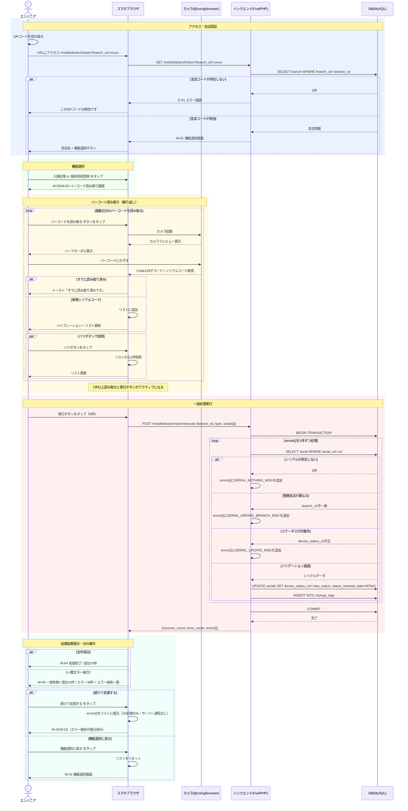

# 開発概要：スマホ版UDS — 支店在庫入庫・回収済み処理

**作成日:** 2026-06-01

---

## 1. 背景・課題

### 現状フロー

各支店の在庫担当者がUDSを立ち上げ、1台ずつバーコードを読み取って「支店在庫入庫」処理を実施している。

### 課題

| # | 課題 | 詳細 |
|---|------|------|
| ① | 業務負荷の集中 | 在庫担当者は日中外作業のため、帰社後（18〜19時以降）の夜間処理になり残業が常態化 |
| ② | 属人化 | 地方の小規模支店では在庫担当者が1名のみ。休むと処理が滞留 |
| ③ | 内部監査指摘 | 受け入れ処理の未実施が指摘されており、業務改善が急務 |

### UF側からの要望

- 在庫担当者以外でも支店在庫入庫作業が可能な状態にする
- UDSへのログイン・PC立ち上げを不要にし、現場のスマホ等で完結させたい

---

## 2. 開発概要

### 採用方式：社用iPhone + QRコードアクセス

UFのエンジニア全員に配布されている社用iPhoneを活用する。UDSに支店ごとの専用URLを用意し、スマホでQRコードを読み取ってアクセスする。AnyConnect（VPN接続アプリ）を使うことでUDSに社内ネットワーク通信する仕組みを構築する。

### 業務フロー（新）

```
① エンジニアが社用iPhoneで、各支店に配布されたQRコードを読み取る
          ↓
② UDSのスマホ版ページが表示される
   例）https://mobile.uds.usen.co.jp/manage/branch/device/store?branch_cd=xxxxxxx
          ↓
③ バーコードを読み取る（複数端末がある場合は連続で読み取る）
          ↓
④ 「入庫処理」または「端末回収登録」ボタンを押下
          ↓
⑤ 対象支店の処理が一括実行される
```

### メリット・デメリット

| 観点 | 内容 |
|------|------|
| ✅ センター作業不要 | 現場で即時処理が完結 |
| ✅ リアルタイム性 | 帰社後の夜間処理が不要になる |
| ✅ 誰でも操作可能 | 専用画面のためUDS全体の習熟が不要 |
| ✅ PCレス | PCの起動・ログインが不要 |
| ✅ 中間ファイル不要 | スプシ等を介さない |
| ✅ 社外作業対応 | VPN利用でセキュリティを担保 |
| ⚠️ URL分離が必要 | 既存URLとのサブドメイン分離が必要 |
| ⚠️ QRコード配布の手間 | 支店ごとにQRコードを生成・配布する運用が必要 |
| ⚠️ 支店横断の操作リスク | URLを知っていれば別支店への操作が可能になる |
| ⚠️ 開発・インフラ工数 | 既存と比較して工数が大きい |

---

## 3. 機能仕様

### 提供機能

| 機能 | 概要 |
|------|------|
| 入庫処理 | バーコードを読み取った端末をまとめて支店在庫入庫処理する |
| 端末回収登録 | バーコードを読み取った端末をまとめて回収済みに変更する |

### 仕様ポイント

- 処理・バリデーションは現状と変更なし
- スマホ版では複数端末の**一括処理**に対応（バーコードを連続で読み取ってからボタン押下）
- 既存の入庫処理・回収済み機能は閉じず、処理の変更もなし

---

## 4. インフラ設計（暫定）

### FQDN

| 環境 | FQDN |
|------|------|
| 検証 | `mobile-stg.uds.usen.co.jp` |
| 本番 | `mobile.uds.usen.co.jp` |

- 社内DNSに登録する

### アクセス経路

```
社用iPhone → AnyConnect(VPN) → 社内LAN → TGW → UDS（EC2）※Publicサブネット
```

- TGWは社内LANのソースIPのレンジで許可する

### EC2

| 環境 | 情報 |
|------|------|
| uds_staging | 52.195.73.248 / 10.203.37.203 |
| uds_production | 57.182.37.87 / 10.203.37.24 |

- 両環境ともPublicサブネットに配置
- VPC: `uds-vpc (vpc-0b5e1a572b65c8a58)`

### VPC

| 項目 | 値 |
|------|-----|
| VPC | uds-vpc (`vpc-0b5e1a572b65c8a58`) |
| CIDRブロック | `10.203.37.0/24` |
| ルートテーブル | `uds-vpc-private-route-table` |
| TGWルート | `10.203.44.128/26` → `tgw-00110dd232298b269` |

### サブネット

- `uds-vpc-public-subnet-1a`
- `uds-vpc-public-subnet-1c`
- `uds-vpc-private-subnet-1c`
- `uds-vpc-private-subnet-1d`

### 証明書

- `*.uds.usen.co.jp`（東京リージョン）

---

## 5. 運用設計

### QRコード配布フロー

```
支店の増減発生
      ↓
越智さん → UDS開発側に連絡
      ↓
UDS開発側でQRコード生成・配布
      ↓
Googleドライブに格納・スプレッドシートで一元管理
```

### スプレッドシート管理項目

| 項目 |
|------|
| QRコードURL（GoogleドライブのファイルURL） |
| 支店名 |
| 支店コード |
| 追加日 |

---

## 6. 検証・リリース方針

- STG環境の検証には越智さんも参加いただく
- 開発スケジュールが見えたら越智さんに共有する

---

## 7. 確認事項・未決定事項

| # | 内容 | 確認先 |
|---|------|--------|
| 1 | 別支店URLへの操作リスクに対するアクセス制御の要否 | 依頼元・セキュリティ |
| 2 | 社内DNS登録の手続きと担当 | インフラ担当 |
| 3 | TGW設定・社内LANのソースIPレンジ確認 | インフラ担当 |
| 4 | 開発スケジュール（越智さん共有タイミング） | 開発リード |

---

## 8. システムフロー図


