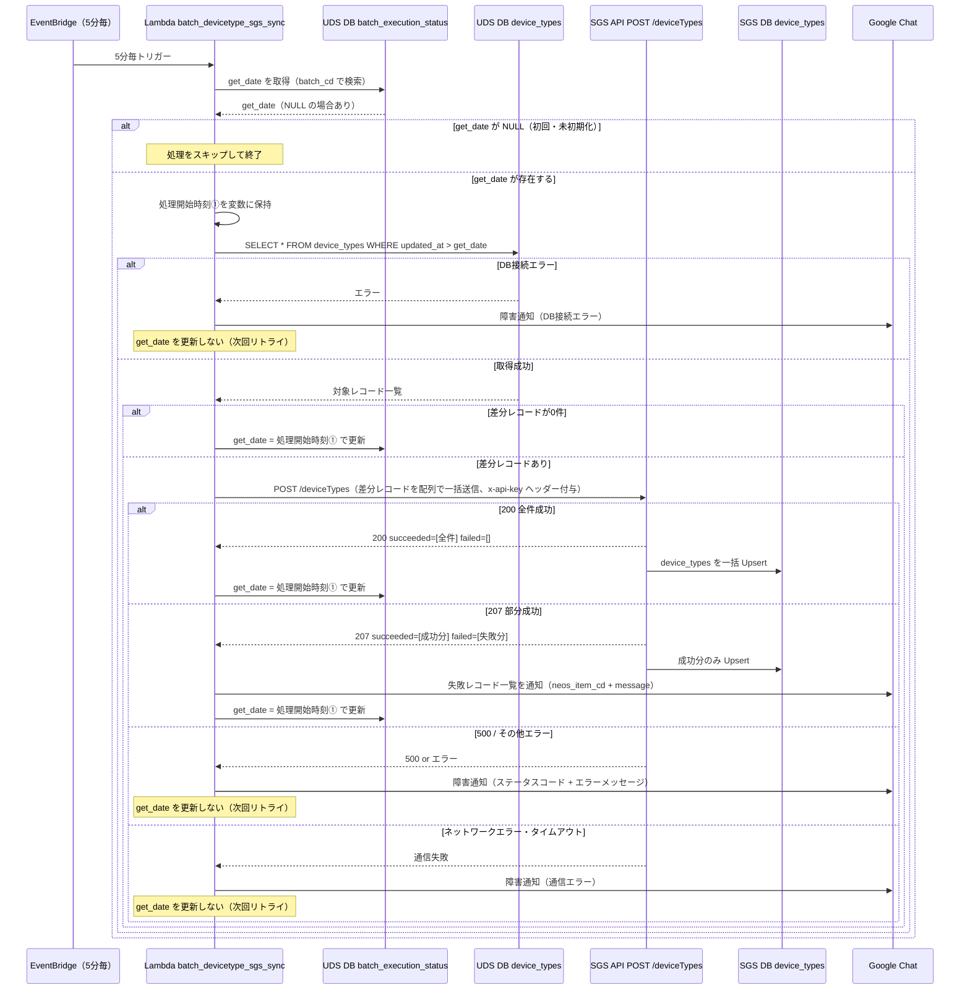

# 改修概要：UDS → SGS デバイス種別マスタ同期

# 背景・課題

SGS および UDS はそれぞれ独立した device\_types（デバイス種別マスタ）テーブルを保持している。
現状、SGS 側の device\_types が更新されるトリガーが存在しないため、**UDS 側でマスタが更新されても SGS 側には反映されない**。その結果、SGS が保持するデバイス種別情報が古いまま残り、**SGS での契約連携処理が正常に行われない問題**が発生している。

# 改修目的

UDS 側の device\_types に変更が発生した際に、SGS が提供する Upsert API を UDS 側から呼び出すことで、**SGS のデバイス種別マスタをリアルタイムに同期**する。

# 改修後フロー

```
UDS: device_types テーブル更新
        ↓
UDS: 5分毎に新規 Lambda（batch_devicetype_sgs_sync）が起動
        ↓
HTTP POST: SGS の /deviceTypes を差分レコード配列で一括呼び出し
        ↓
SGS: device_types テーブルを Upsert（新規 or 更新）
        ↓
SGS: 契約連携処理が正常に行われる
```

# SGS 提供 API 仕様

swagger：https://fztmn293x7.execute-api.ap-northeast-1.amazonaws.com/v1/swagger

```
POST /deviceTypes
```

request body は対象レコードの配列（`neos_item_cd` のみ必須、他は任意）：

```json
[
  {
    "neos_item_cd": "12345678901234",
    "device_type": "router",
    "neos_item_name": "商材名",
    ...
  },
  {
    "neos_item_cd": "98765432109876",
    ...
  }
]
```

> ⚠️ **リクエストサイズ上限：約6MB**。通常の5分バッチ差分では問題ないが、何らかの理由で大量差分が発生した場合は超過する可能性がある。その場合の分割送信については要検討（現時点では対応なし）。

> **同一 `neos_item_cd` が配列内に重複した場合**：後勝ちで更新される（エラーにはならない）。

### レスポンス仕様

| ステータス | 意味 | `succeeded` | `failed` |
|---|---|---|---|
| 200 | 全件成功 | 全レコード | 空配列 |
| 207 | **部分成功**（一部失敗） | 成功分 | 失敗分（`neos_item_cd` + `message`） |
| 500 | 全件失敗 | 空配列 | 全レコード（`neos_item_cd` + `message`） |

```json
// 207 のレスポンス例（SGS確認済み）
{
  "message": "Upsert partially succeeded",
  "succeeded": [
    { "id": 1, "neos_item_cd": "9604073_n02", ... }
  ],
  "failed": [
    {
      "neos_item_cd": "Z110423_n02",
      "message": "neos_item_cd: Z110423_n02 は削除済みのため更新できません"
    }
  ]
}
```

> `failed[].message` の内容は削除済みケース以外（バリデーションエラー等）は**未確定**。SGS側の実装確定後に確認すること。

**失敗対象となる主なケース**：`deleted_at IS NOT NULL` の削除済みレコードへの更新（その他のバリデーションエラー等は未確定）

```json
{
  "dev": {
    "baseUrl": "https://fztmn293x7.execute-api.ap-northeast-1.amazonaws.com/v1",
    "apiKey": "f60KrY1WWf35857XZVuKI2E67fN3wPIx1UZVFTr1"
  },
  "stg": {
    "baseUrl": "https://tkplb5nvq4.execute-api.ap-northeast-1.amazonaws.com/v2",
    "apiKey": "bjCjYAnKJF4Z74RhtQNdD5YdDl5uq5DF702kYulZ"
  },
  "prd": {
    "baseUrl": "https://3uqjkpfj18.execute-api.ap-northeast-1.amazonaws.com/v2",
    "apiKey": "dJ3PbLHd4w6FtulDNQDcA3nJnrghhJFa7e19po6l"
  }
}
```

# 改修内容詳細

| 対象 | 内容 |
| ----- | ----- |
| Lambda | batch\_devicetype\_sgs\_sync（新規作成） |
| トリガー | ~~案1:UDS の device\_types テーブル更新時~~ 案2バッチでの実行 5分毎 |
| 処理内容 | UDS の device\_types テーブルから差分レコードを取得し、配列にまとめて SGS の POST /deviceTypes を1回呼び出し。成功・失敗をログ出力 |

# 考慮事項・確認事項

| \# | 項目 | 内容 | 状態 |
| ----- | ----- | ----- | ----- |
| 1 | トリガー方式 | バッチ（定期実行）か、device\_types 更新処理からの直接呼び出しか**→バッチ5分** | **確認OK** |
| 2 | SGS API の認証 | x-api-key ヘッダーで認証 | **確認OK** |
| 3 | SGS API の URL（環境別） | dev / stg / prd それぞれのエンドポイント URL | **確認OK** |
| 4 | エラー時のリトライ | 207は last\_executed\_at を更新して人が対応。500・通信エラーは更新せず次回バッチで自動再送 | **確認OK** |
| 5 | 全件初期同期 | リリース完了報告とセットで今さんに最新の CSV を共有 | **確認OK** |
| 6 | リクエストサイズ上限 | 約6MB。通常差分では問題ないが大量差分時は超過の可能性あり。分割送信は現時点で対応なし | **確認OK** |
| 7 | 重複 neos\_item\_cd の挙動 | 配列内に同一 neos\_item\_cd が重複した場合は後勝ちで更新（エラーにはならない） | **確認OK** |
| 8 | failed[].message の内容 | 削除済みケース以外（バリデーションエラー等）は未確定。SGS 側実装確定後に確認 | **要確認** |
| 9 | Lambda 作成に伴うインフラへのロール依頼 | | |

# 開発期間

1週間～2週間

# ⚠️リリース時の注意点

- [ ] 今さんにSTGアップ、本番リリース日の共有必要
- [ ] リリース時には、該当環境のデバイス種別マスタのcsvを共有

---

# batch_execution_status テーブル定義

バッチの差分取得基準日時を管理するテーブル。1バッチにつき1レコードで管理する。

| カラム名 | 型 | NOT NULL | Key | 説明 |
|---|---|---|---|---|
| id | INT AUTO_INCREMENT | ✓ | PRIMARY KEY | 主キー |
| batch_cd | VARCHAR(10) | ✓ | UNIQUE KEY | バッチを識別するために使う（例: 00001） |
| batch_name | VARCHAR(100) | ✓ | - | バッチ名（例: UDS-SGS間デバイス種別マスタ同期バッチ） |
| get_date | DATETIME | - | - | 差分があった場合の前回取得日時。次回の差分取得基準に使用 |
| created_at | DATETIME | ✓ | - | 作成日時（DEFAULT CURRENT_TIMESTAMP） |
| updated_at | DATETIME | ✓ | - | 更新日時（自動更新） |
| deleted_at | DATETIME | - | - | 削除日時（論理削除用） |

> **初期データ**：リリース時に `batch_cd` のレコードが存在しない場合（`get_date` が取得できない場合）、Lambda は処理をスキップして終了する（初回全件同期は手動 CSV 連携で実施済みのため）。CSV 連携完了後に `get_date = CSV連携実施日時` で INSERT すること。

---

# シーケンス図



> **get_date の更新タイミング**：処理完了後ではなく「処理開始時刻①」で更新する。これにより、バッチ実行中に更新されたレコードが次回バッチで再取得されるため、取りこぼしが発生しない。
> **500 時は get_date を更新しない**：SGS サーバー側の一時障害が原因である可能性が高く、次回バッチで自動回復が期待できるため。
> **207 時は get_date を更新する**：失敗原因はリトライしても解決しないケース（削除済みレコード等）が主のため、人が Google Chat 通知を受け取って対応する。次回バッチは新しい差分のみを処理する。

---

# エラーハンドリング設計

## 考え方の基本

エラーハンドリングとは「**何かが失敗したとき、どう対処するか**を事前に決めておくこと」。
考えるときは以下の3点を整理する。

1. **何が失敗しうるか**（エラーの種類を列挙する）
2. **そのエラーが起きると何に影響するか**（影響範囲）
3. **どう対処するか**（ログだけ出す・リトライする・アラートを上げる など）

---

## このバッチで起きうるエラーと対処方針

### ① UDS DB 接続エラー

| 項目 | 内容 |
|---|---|
| 発生タイミング | 差分レコード取得時（SELECT） |
| 影響 | SGS への送信が1件もできない |
| 対処 | エラーログを出力して Lambda を終了する。`get_date` は更新しない → 次回バッチで自動リカバリ |

---

### ② SGS API: 200（全件成功）

| 項目 | 内容 |
|---|---|
| 影響 | なし（正常系） |
| 対処 | `get_date` を処理開始時刻で更新する |

---

### ③ SGS API: 207（部分成功）

| 項目 | 内容 |
|---|---|
| 発生ケース | `failed` に含まれるレコードは削除済みのため更新不可（その他バリデーションエラー等は未確定） |
| 影響 | 一部のレコードが SGS に反映されていない |
| 対処 | `failed` の内容を Google Chat に通知する。`get_date` は**処理開始時刻で更新する** |

> **ポイント**：失敗原因は「削除済みレコードへの更新」など**リトライしても解決しないケース**が主のため、自動リトライではなく人が通知を受け取って判断・対応するフローにする。`get_date` を更新することで次回バッチは新しい差分のみを処理する。

---

### ④ SGS API: 500（全件失敗）

| 項目 | 内容 |
|---|---|
| 発生ケース | SGS サーバー側の異常 |
| 影響 | 全レコードが SGS に反映されていない |
| 対処 | エラーログを出力。`get_date` は**更新しない** → 次回バッチで自動再送 |

---

### ⑤ ネットワークエラー・タイムアウト

| 項目 | 内容 |
|---|---|
| 発生ケース | SGS への HTTP リクエスト自体が失敗（通信断・タイムアウト） |
| 影響 | SGS の処理結果が不明（成功したかどうかわからない） |
| 対処 | エラーログを出力。`get_date` は**更新しない** → 次回バッチで再送（Upsert のため冪等） |

---

## エラー設計まとめ

| ケース | get_date | Google Chat通知 |
|---|---|---|
| 200 全件成功 | ✅ 処理開始時刻①で更新 | なし |
| 差分0件スキップ | ✅ 処理開始時刻①で更新 | なし |
| 207 部分成功 | ✅ 処理開始時刻①で更新 | ✅ 失敗レコード一覧を通知（neos_item_cd + message） |
| 500 / その他エラー | ❌ 更新しない | ✅ 全件失敗を通知（ステータスコード + エラーメッセージ） |
| DB 接続エラー | ❌ 更新しない | ✅ 通知 |
| ネットワークエラー | ❌ 更新しない | ✅ 通知 |
| 初期化未済（get_date が NULL） | ❌ 更新しない | なし（スキップして終了） |

**207 と 500 で get_date の扱いを変える理由**

- **207**：失敗原因が「削除済みレコード」など**リトライしても解決しないケース**が主。人が通知を受け取って判断・対応するフローにする。get_date を更新することで次回バッチは新しい差分のみを処理する。
- **500**：SGS サーバー側の一時障害が原因である可能性が高く、**次回バッチで自動回復が期待できる**。get_date を更新しないことで次回バッチが自動リトライする。
