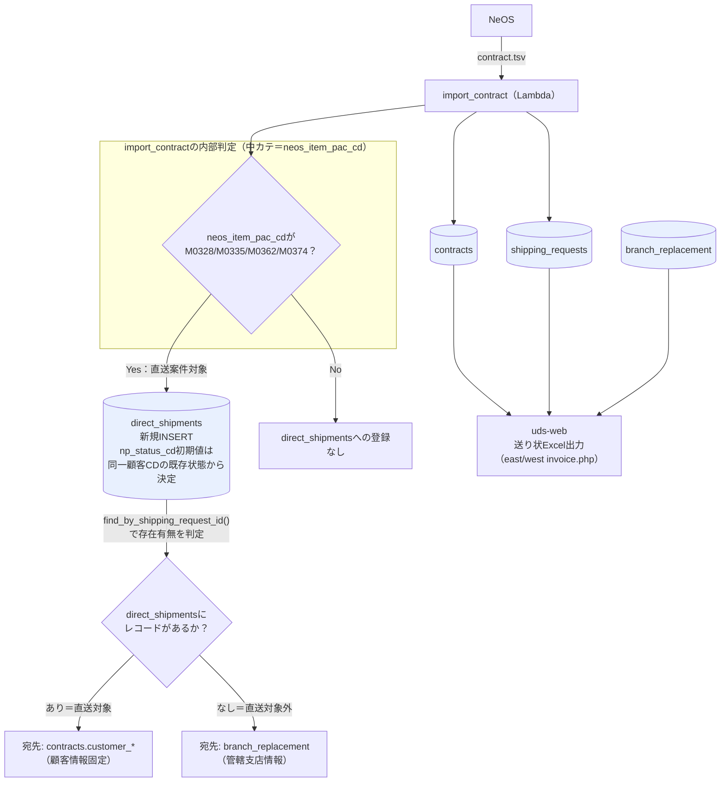
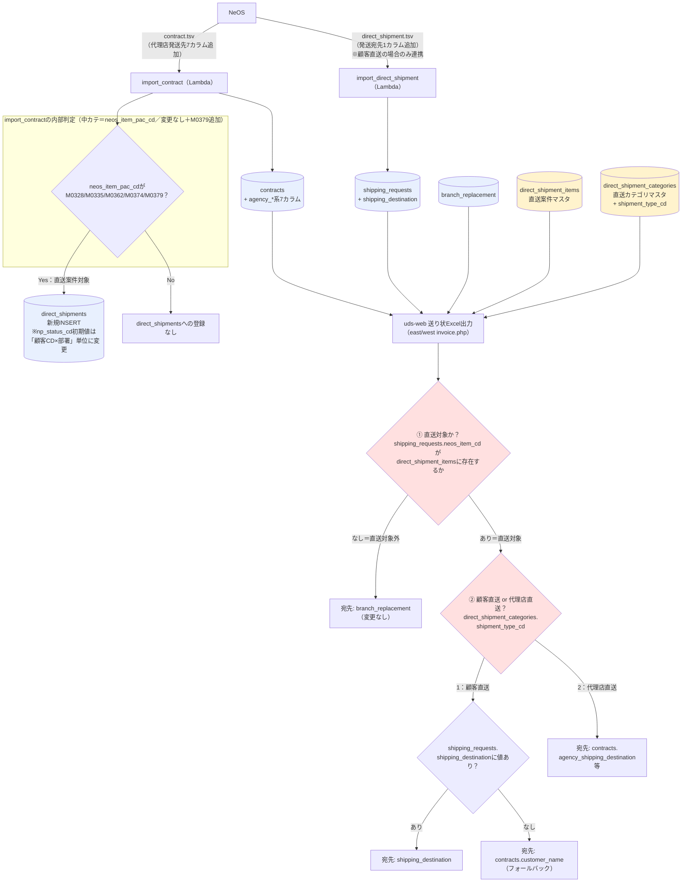
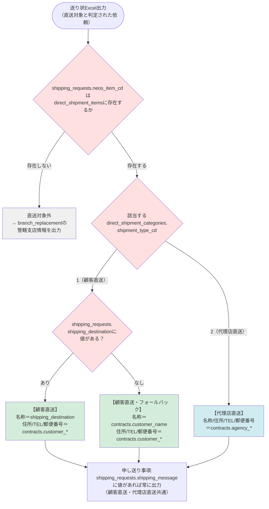
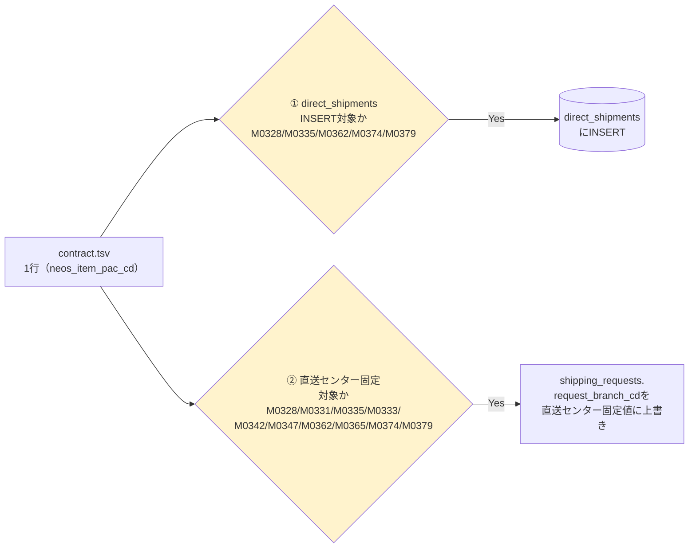

# 処理フロー図 — import_contractから送り状出力まで

**関連ドキュメント:** `改修概要_顧客直送代理店直送対応.md`

---

## 1. 現状（As-Is）の全体データフロー

**ポイント**
- 直送対象か否かの判定は、送り状出力時に`direct_shipments`テーブルの**存在有無**を見るだけ（`Model_Direct_Shipment::find_by_shipping_request_id()`）
- 「顧客直送」と「代理店直送」の区別は存在しない（代理店直送という概念自体が今回新設）
- `direct_shipments`への登録は、import_contract内の`neos_item_pac_cd`ハードコード（中カテ）判定のみで決まる

---

## 2. 変更後（To-Be）の全体データフロー

**ポイント（As-Isからの変更点）**
- import_contract内の中カテ判定は**変更しない**。対象コードに`M0379`（代理店直送）を追加するのみ
- uds-web側の「直送対象か否か」の判定は、`direct_shipments`の存在チェックから**直送案件マスタ参照**に変更
- 新たに「顧客直送 or 代理店直送」の判定ステップが追加され、**直送カテゴリマスタの`shipment_type_cd`**で判定する
- `direct_shipment_items`／`direct_shipment_categories`（黄色）は、USEN MUSIC自体のデータがまだ登録されておらず、判定が機能するにはこのマスタ拡充が前提条件（改修概要書 10章参照）

---

## 3. 「顧客直送 or 代理店直送」の判断基準（決定木）

**判断基準まとめ**

| 段階 | 判定内容 | 参照データ |
|---|---|---|
| ① 直送対象か否か | `neos_item_cd`が直送案件マスタに登録されているか | `direct_shipment_items` |
| ② 顧客直送 or 代理店直送 | ①で該当したカテゴリの直送種別CD | `direct_shipment_categories.shipment_type_cd` |
| ③ 顧客直送の中での宛先優先順位 | `shipping_destination`の値の有無 | `shipping_requests.shipping_destination` → なければ`contracts.customer_name` |

> ⚠️ ①②の判定はマスタにUSEN MUSIC自体のデータ（`neos_item_cd`・カテゴリ）が登録されて初めて正しく機能する。現時点では未登録のため、事業部・NeOS側への確認結果を待って初期データを整備する必要がある（詳細は改修概要書 10章）。

---

## 4. import_contract内の「2つの中カテ判定」の位置づけ（参考）

送り状出力の判定（上記2・3）とは別に、import_contract内部には**変更しない**独立した中カテ判定が2つ残る。

①②は目的（NP審査追跡 / 物流ルーティング）も対象コード範囲も異なる別ロジック。今回はどちらも**判定方式は変更せず**、`M0379`（代理店直送）をそれぞれのハードコードリストに追加するのみ。
